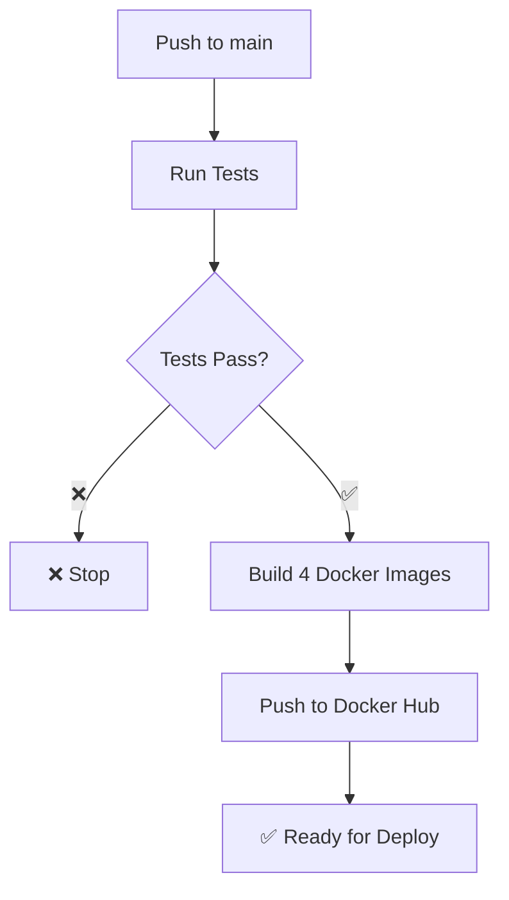

# 🚀 Quick Start: Docker CI/CD

## ⚡ Setup trong 5 phút

### 1. Cấu hình GitHub Secrets
Vào Repository → Settings → Secrets → Actions, thêm:
```
DOCKER_USERNAME=your-dockerhub-username  
DOCKER_PASSWORD=your-dockerhub-token
JWT_SECRET=my-super-secret-jwt-key
LOGIN_TEST_USER=testuser
LOGIN_TEST_PASSWORD=password123
```

### 2. Push code lên main branch
```bash
git add .
git commit -m "feat: add Docker CI/CD pipeline"  
git push origin main
```

### 3. Kiểm tra GitHub Actions
- Vào tab **Actions** trong repository
- Workflow sẽ chạy tự động: Test → Build → Push

## 📦 Kết quả sau khi thành công

### Docker Images được tạo:
```
your-username/eproject-auth:latest
your-username/eproject-product:latest  
your-username/eproject-order:latest
your-username/eproject-api-gateway:latest
```

### Chạy local với Docker:
```bash
# Clone và chạy tất cả services
git clone your-repo
cd Docker_Test_V4
docker-compose up -d

# Kiểm tra services
curl http://localhost:3000/dashboard  # Auth
curl http://localhost:3001/           # Product  
curl http://localhost:3002/           # Order
curl http://localhost:3003/           # Gateway
```

## 🎯 Luồng CI/CD hoàn chỉnh



## 🔧 Services Port Mapping

| Service | Local Port | Container Port | Docker Image |
|---------|------------|----------------|--------------|
| Auth | 3000 | 3000 | `eproject-auth` |  
| Product | 3001 | 3001 | `eproject-product` |
| Order | 3002 | 3002 | `eproject-order` |
| Gateway | 3003 | 3003 | `eproject-api-gateway` |
| MongoDB | 27017 | 27017 | `mongo:6.0` |
| RabbitMQ | 5672,15672 | 5672,15672 | `rabbitmq:3.11` |

## ✅ Checklist hoàn thành

- [x] **GitHub Actions Workflow** - CI/CD pipeline
- [x] **Docker Images** - 4 services với Dockerfiles tối ưu
- [x] **Docker Hub Integration** - Auto push sau test thành công  
- [x] **Multi-service Testing** - Auth + Product tests
- [x] **Docker Compose** - Local development environment
- [x] **Port Configuration** - Correct ports cho từng service
- [x] **Environment Variables** - Cấu hình hoàn chỉnh

## 🚀 Next Steps

1. **Deploy to staging** - Sử dụng images từ Docker Hub
2. **Add health checks** - Monitoring cho production
3. **Security scanning** - Scan images trước khi deploy
4. **Auto-deploy** - CD pipeline đến server production